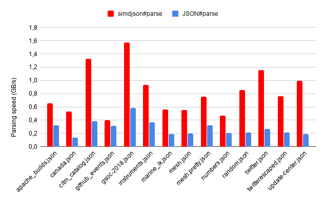

# simdjson, Node.js and Napi::ObjectWrap

## A Napi::ObjectWrap that allows to use C++ simdjson library with Node.js
This is a project wrapping the simdjson library for un use in Node. 
**Note** : This is a master projet and is **still in developement**. I am still woriking on some approaches to omptimze performances, but results so far seems interesting.  

## Requirements
(to be completed). When upgraded to simdjson 3.0 (coming soon!), any computer shoud be able to run projet. Performances are a lot more interesting on computers with an SIMD architecture. 

## Getting started
```
git clone https://github.com/croteaucarine/simdjson_node_objectwrap
cd simdjson_node_objectwrap
npm install
```

## Constructor
- new simdjson() : Creates an empty object. load and parse must be called in order to manipulate the object.
- new simdjson(string document) : Creates a fully manipulable object. 
- new simdjson(object path) : Key path must me used to send defined path as string (example : {path : 'mydoc.json'}). Creates a fully manipulable object. 
- new simdjson(object doc) : Key path must me used to send document as string (example : {doc : docVariable}). Creates a fully manipulable object. 

## Code usage and example
The library implements JSON parsing and basic JSON methods length and keys. It is also iterable and compatible with JSON.stringify(), Object.getOwnPropertyNames(), and Object.getOwnPropertyDescriptors(). The library also implements navigation through JSON pointer defined by the [RFC6901 standard](https://tools.ietf.org/html/rfc6901).

### Basic usage example
Example below is also available in repo under the file example.js and can be run with ```node example.js```

```javascript
'use strict';

const fs = require('fs');
const { simdjson } = require('bindings')('addon');

const simdjsonOBJ = new simdjson({path : 'jsonexamples/github_events.json'});

// Display object content
console.log(simdjsonOBJ);

// Display Object Keys
console.log(simdjsonOBJ.keys());

// Display Object length
console.log(simdjsonOBJ.length);

// Display strignified Object
console.log(JSON.stringify(simdjsonOBJ));

// Display Own Property Names
console.log(Object.getOwnPropertyNames(simdjsonOBJ));

// Display Own Property Descriptors
console.log(Object.getOwnPropertyDescriptors(simdjsonOBJ));

// Loop through JSON Array 
// try-catch intercepts error if object is not an array
try {
    var i  = 1;
    for (let item of simdjsonOBJ) {
        console.log(item);
        i++;
    }
} catch(error) {
    console.error(error);
}

// Display nested elements
try {
    var i  = 1;
    for (let item of simdjsonOBJ) {
        console.log(item.actor.login);
        i++;
    }
} catch(error) {
    console.error(error);
}
```

### JSON Pointer example ([JavaScript Object Notation (JSON) Pointer (RFC 6901)](https://tools.ietf.org/html/rfc6901))
Example below and more JSON Pointer uses are also available in repo under the file jsonPointer.js and can be run with ```node jsonPointer.js```

```javascript
const twitter = 'jsonexamples/twitter.json';
content = fs.readFileSync(twitter, 'utf-8');
simdjsonOBJ = new simdjson(content);

console.log("JSON pointer : /statuses/0/id");   // outputs 505874924095815700
console.log("JSON pointer : /statuses/1/id");   // outputs 505874922023837700

```

```javascript
'use strict';

const fs = require('fs');
const { simdjson } = require('bindings')('addon');

const demo = 'jsonexamples/small/demo.json';
var content = fs.readFileSync(demo, 'utf-8');
var simdjsonOBJ = new simdjson(content);

console.log("JSON pointer : /Image/IDs/2");
console.log(simdjsonOBJ.getValue('/Image/Width'));  // outputs 800
console.log(simdjsonOBJ.getValue('/Image/Height')); // outputs 600
console.log(simdjsonOBJ.getValue('/Image/Width') * simdjsonOBJ.getValue('/Image/Height')); // outputs 480000
```

## Benchmarks
The script benchmarks.js contains the comparaison between the default JavaScript method JSON.parse and parsing with simdjson. 
The benchmarks runs with multiple JSON file formats that are located in the jsonexamples folder. 
To run benchmarks : ```node --exopse-gc benchmarks.js```

**Note** : Parts of code have been rewritten after the publications of theses benchmarks. New benchmarks will be published soon!

### Benchmarks results in GB/s
|      File       |        JSON#parse        | simdjson#parse |
| ------------- | ------------- |------------- |
| apache_builds.json |       0.3508060654       |  1.2776726171       |
| canada.json |       0.1411976798       | 0.6375911861       |
| citm_catalog.json |       0.4489479678       |  0.3123227330       |
| github_events.json |       0.3431752242       |  0.8627043830       |
| gsoc-2018.json |       0.6820689779       |  1.2901085179       |
| instruments.json |       0.3263017406       |  1.0613046511       |
| marine_ik.json |       0.1985107722       |  0.5801906399       |
| mesh.json |       0.2001960761       |  0.5928486893       |
| mesh.pretty.json |       0.3109946339       |  0.5928486893       |
| numbers.json |       0.2051137580       |  0.6850210674       |
| random.json |       0.2188974147       |  0.2741147806       | 
| twitter.json |       0.2819563119       |  0.3169782538       | 
| twitterescaped.json |       0.2307891846       |   0.8102025150       |
| update-center.json |       0.1986242831       |  0.2975296458       | 

## Performance results
**Note** : Parts of code have been rewritten after the publications of theses results. New graph will be published soon!



## License
This code is made available under the Apache License 2.0.


